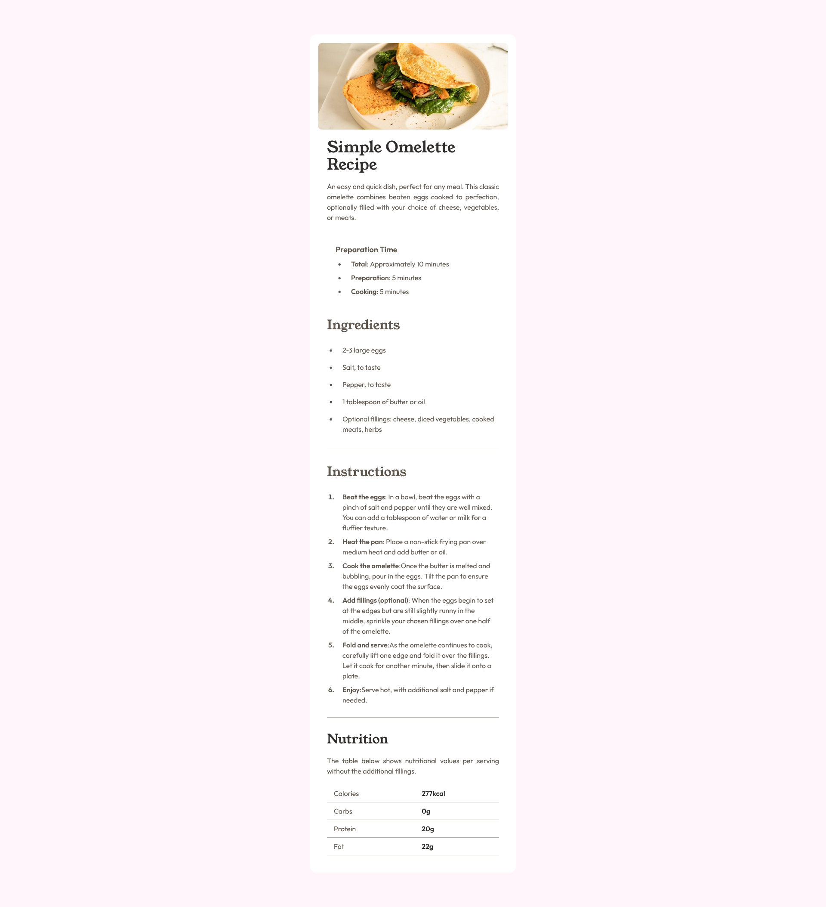

# Frontend Mentor - Recipe page solution

This is a solution to the [Recipe page challenge on Frontend Mentor](https://www.frontendmentor.io/challenges/recipe-page-KiTsR8QQKm). Frontend Mentor challenges help you improve your coding skills by building realistic projects.

### Screenshot

### Links

-   Solution URL: [Github Repo](https://github.com/shivendra8004/Recipe-Page-Challange.git)
-   Live Site URL: [Netlify](https://recipe-page-shivendra.netlify.app/)

### Built with

-   NextJs
-   Tailwind CSS
-   Mobile-first workflow
-   [React](https://reactjs.org/) - JS library
-   [Next.js](https://nextjs.org/) - React framework
-   [Styled Components](https://tailwindcss.com/) - For styles

## Author

-   Github - [Shivendra Jat](https://github.com/shivendra8004)
-   Frontend Mentor - [@shivendra8004](https://www.frontendmentor.io/profile/shivendra8004)
-   LinkedIn - [@shivendrajat](https://www.linkedin.com/in/shivendrajat/)
